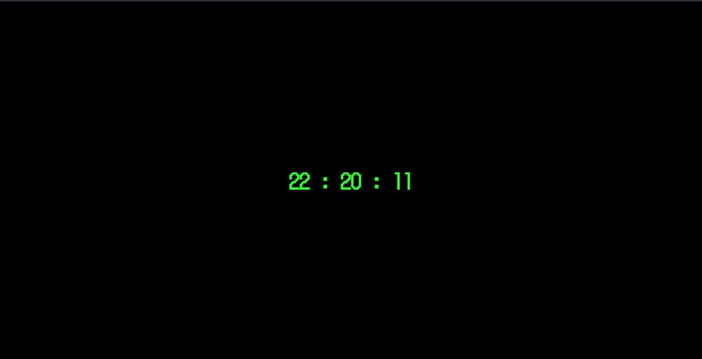

# ClockJS-Retro

**ClockJS-Retro** is a basic Clock made with **HTML, CSS & JavaScript** in a Retro / Old School Terminal Color Scheme.

This project makes the use of following :

- ES6 Syntax
- CSS KeyFrame Animations

Star the repo if you like it.

You can fork this repo if you want.
<<<<<<< HEAD

## Screenshot

=======
>>>>>>> 8f95a75126c93c406c06d2256f3bebff0ea442ea
